# reach-taskq

A production-minded distributed task queue and job-processing platform.

- **Durable**: jobs, idempotency, audit, and outbox live in PostgreSQL — single source of truth.
- **Fast**: Redis Streams as the hot transport; submit p95 ~70 ms, sustained 187 RPS on a 4-vCPU dev VM.
- **Multi-tenant**: per-tenant API keys, token-bucket rate limits, and Redis-backed concurrency quotas.
- **Observable**: Prometheus + Grafana + OpenTelemetry traces + structured JSON logs with full MDC propagation.

## Screenshots

| Overview                                      | Jobs                                  | Submit                                    | Job detail                                        |
| --------------------------------------------- | ------------------------------------- | ----------------------------------------- | ------------------------------------------------- |
| 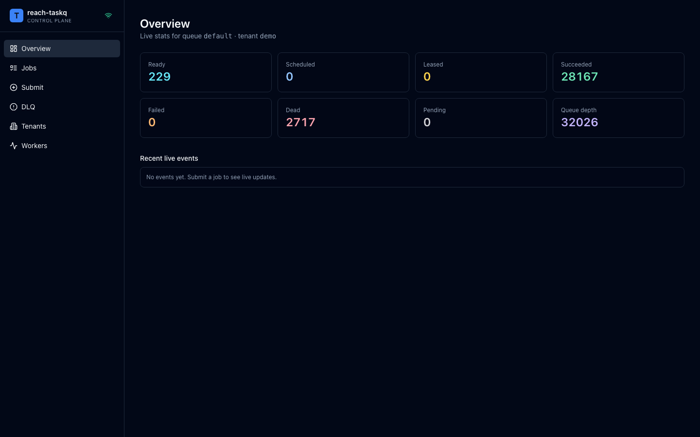 | 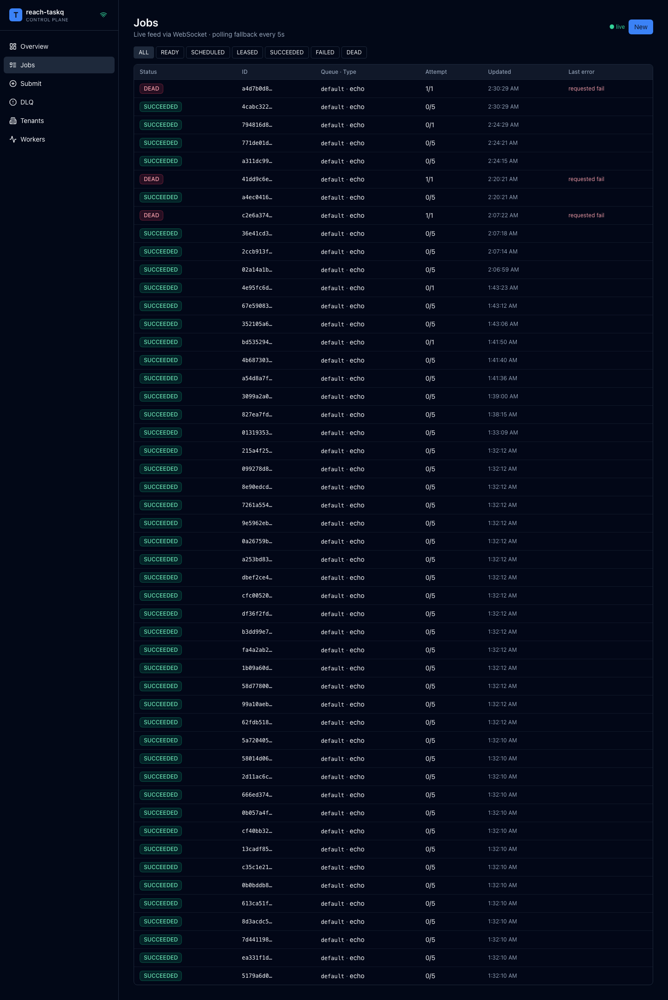 | 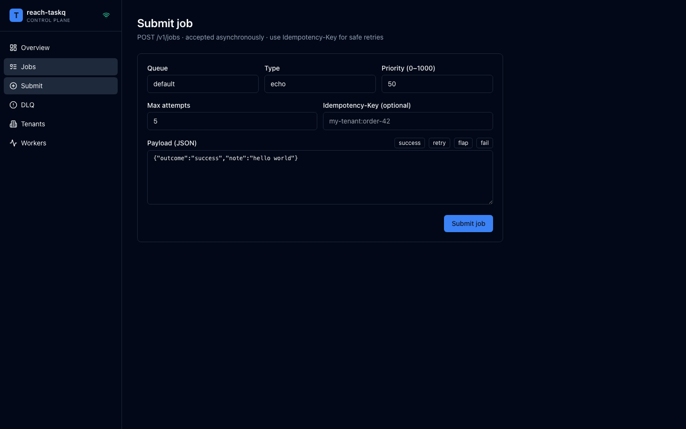 | 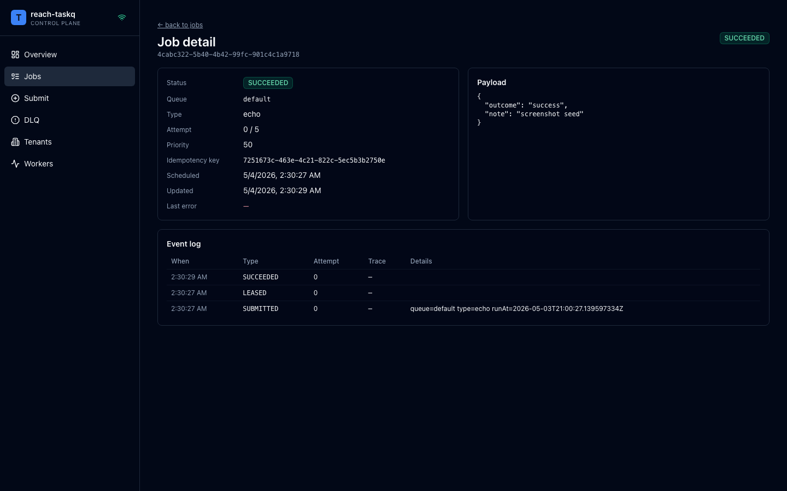 |

| DLQ                                 | Tenants                                     | Workers                                     |
| ----------------------------------- | ------------------------------------------- | ------------------------------------------- |
| 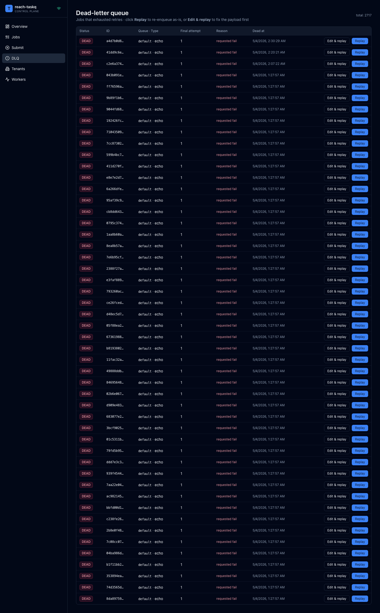 | 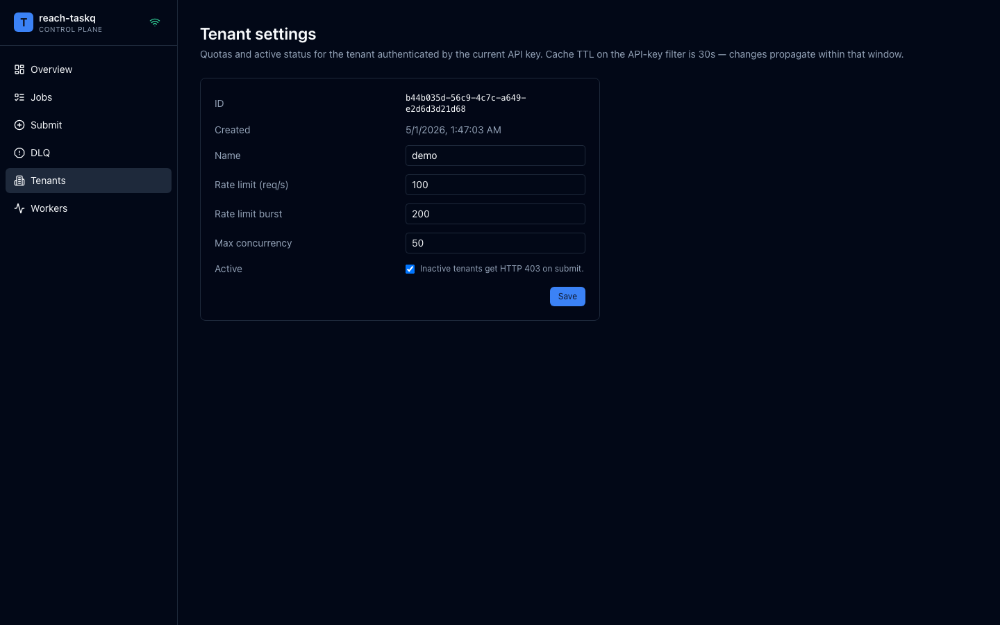 | 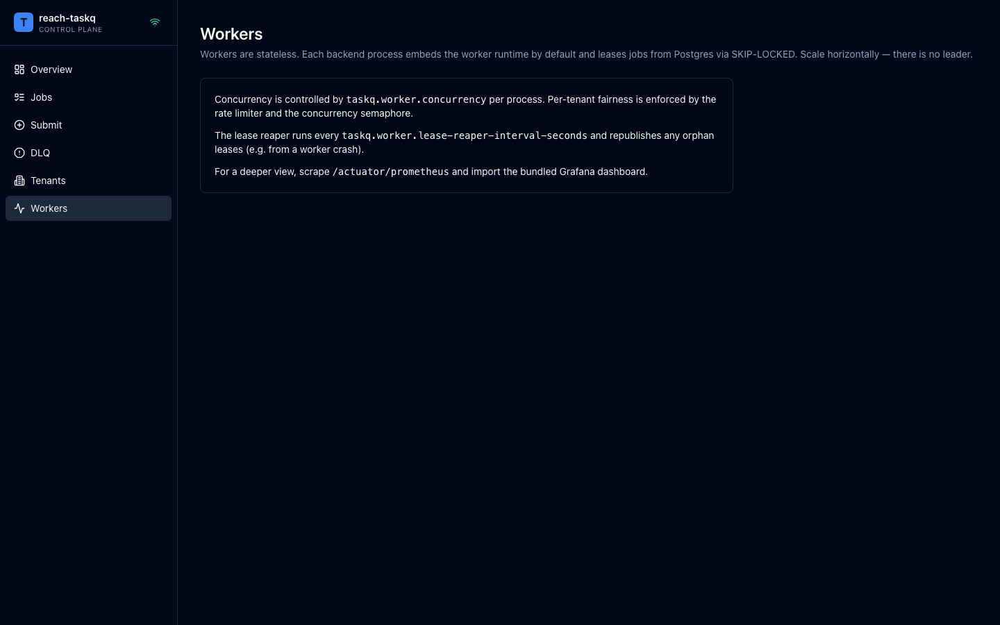 |

Responsive at 1024×768 and 390×844:

| Tablet — Overview                                                   | Tablet — Jobs                                               | Tablet — Submit                                                 |
| ------------------------------------------------------------------- | ----------------------------------------------------------- | --------------------------------------------------------------- |
| 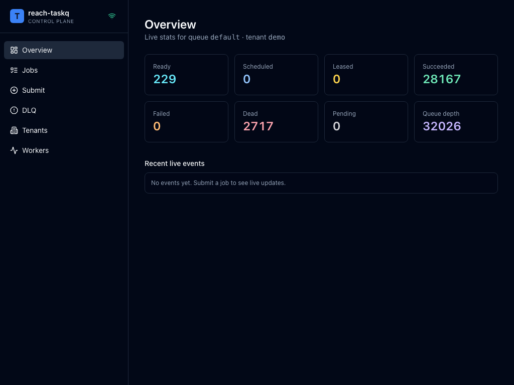 | 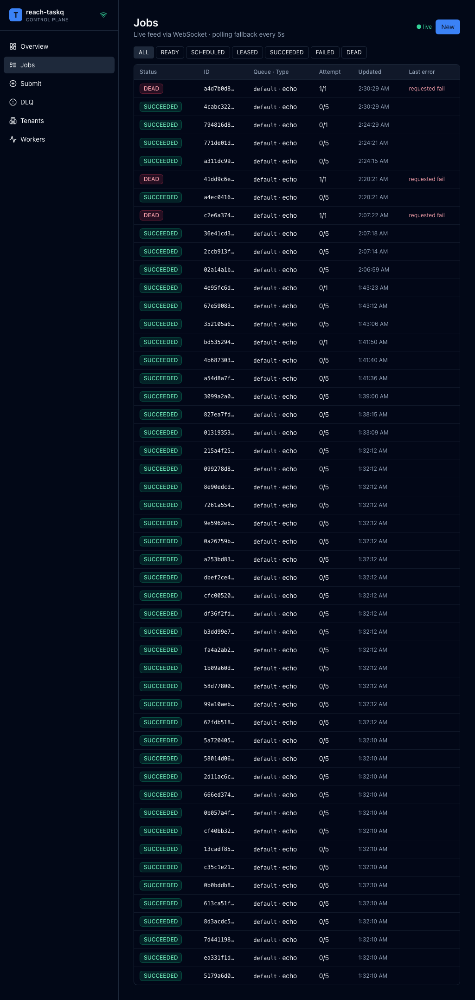 | 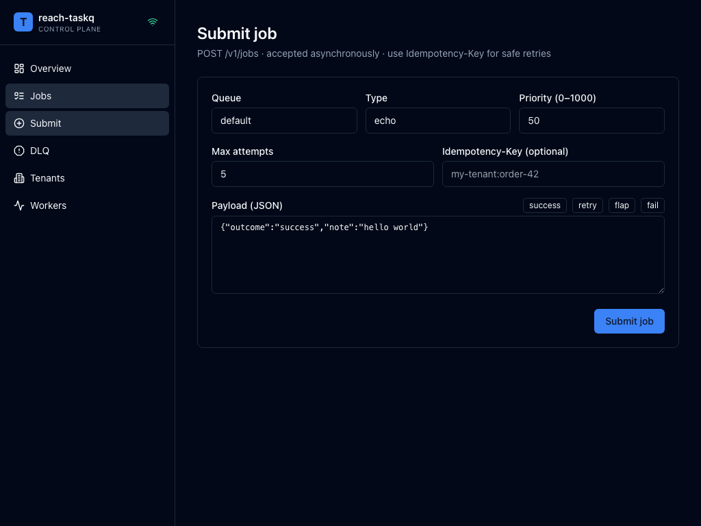 |

| Mobile — Overview                                                   | Mobile — Jobs                                               | Mobile — Submit                                                 |
| ------------------------------------------------------------------- | ----------------------------------------------------------- | --------------------------------------------------------------- |
| 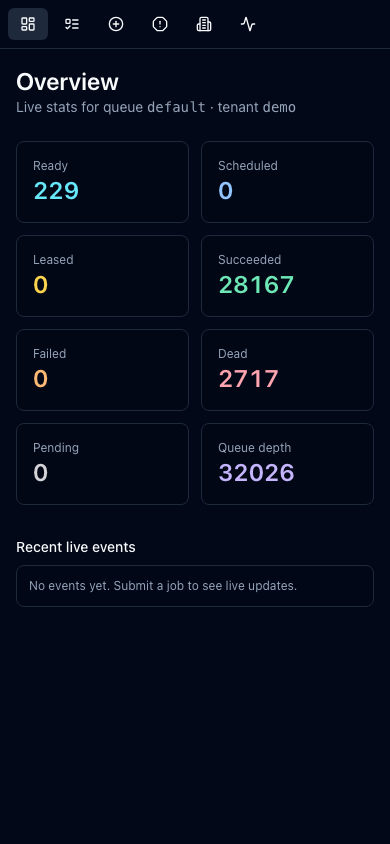 | 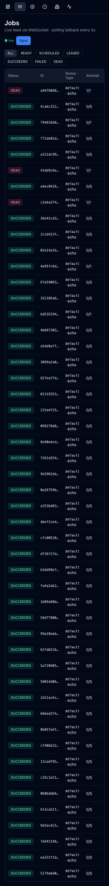 | 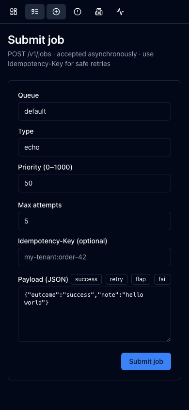 |

Regenerate the gallery with the live stack running:

```bash
cd frontend
E2E_SCREENSHOTS=1 \
E2E_BASE_URL=http://localhost:3000 \
E2E_API_BASE=http://localhost:8080 \
E2E_API_KEY=demo-api-key-do-not-use-in-prod \
  npm run test:e2e:full -- --grep @screenshots
```

## Quick start

Requires Docker (Colima or Docker Desktop on macOS — `colima start --cpu 4 --memory 8 --disk 60`).

```bash
cp .env.example .env
docker compose -f docker/docker-compose.yml up -d
./scripts/seed-tenants.sh
./scripts/demo-traffic.sh
```

| Endpoint                | URL                              |
| ----------------------- | -------------------------------- |
| Dashboard               | http://localhost:3000            |
| API                     | http://localhost:8080/v1         |
| OpenAPI / Swagger UI    | http://localhost:8080/swagger-ui |
| Prometheus              | http://localhost:9090            |
| Grafana (admin / admin) | http://localhost:3001            |

## Architecture

Submit, persist, transport, and process are decoupled at every step. Postgres holds truth, Redis Streams handles the hot path, the worker leases via conditional UPDATE, and the React dashboard subscribes to live status over WebSocket.

```mermaid
flowchart LR
    client[HTTP client] --> api[POST /v1/jobs]
    api --> tx[("jobs + idempotency_keys + outbox<br/>same Postgres tx")]
    tx --> relay[OutboxRelay<br/>pipelined XADD]
    relay --> redis[(Redis Streams<br/>"taskq:stream:default")]
    redis --> worker[WorkerRuntime<br/>virtual threads]
    worker -->|"conditional UPDATE"| tx
    worker --> ws[/WebSocket /ws/jobs/]
    ws --> ui[React dashboard]
```

Detailed component diagrams live in [docs/ARCHITECTURE.md](docs/ARCHITECTURE.md).

## Tech stack

| Backend                                                       | Frontend                               | Ops                                             |
| ------------------------------------------------------------- | -------------------------------------- | ----------------------------------------------- |
| Spring Boot 3.4 / Java 21 (virtual threads)                   | React 18.3 + Vite 5.4 + TypeScript 5.6 | Docker Compose, Colima, multi-stage Dockerfiles |
| PostgreSQL 16 + Flyway, HikariCP                              | Tailwind 3.4 + shadcn/ui               | Helm chart + KEDA `ScaledObject`                |
| Redis 7.2 Streams (Lettuce 6.3 async)                         | TanStack Query 5.59                    | Prometheus 2.54 + Grafana 11.2 OSS              |
| Spring Security (API-key, MDC, 30s tenant cache)              | React Router 6.27                      | OpenTelemetry collector 0.107                   |
| Token-bucket rate limiter + concurrency semaphore (Redis Lua) | Playwright 1.59 (mock + full + a11y)   | postgres / redis / node exporters               |

## Repository layout

```
backend/         Maven multi-module Spring Boot service
  core/          domain entities, JobBroker interface, value objects
  persistence/   JDBC + Flyway migrations
  broker-redis/  Redis Streams JobBroker impl (default)
  broker-postgres/ Postgres SKIP-LOCKED JobBroker impl (proves abstraction)
  ratelimit/     per-tenant token-bucket + concurrency semaphore (Lua)
  api/           REST + WebSocket controllers, Spring Security
  worker/        worker runtime, lease loop, retry executor
  observability/ Micrometer, OpenTelemetry, log MDC
  app/           Spring Boot entry point + wiring
frontend/        React 18 + Vite + TS + Tailwind + shadcn/ui dashboard
docker/          Dockerfiles, docker-compose.yml, Grafana / Prometheus / OTel configs
k8s/             Helm chart + raw manifests + KEDA ScaledObject
load/            k6 load scripts
docs/            ARCHITECTURE.md, RUNBOOK.md, TESTING.md, CONTEXT.md, ADRs, screenshots
postman/         functional + stress collections, Newman + curl bombards
scripts/         seed + demo helpers
```

## Testing

Five-layer pyramid: pure unit, Spring Boot integration via Testcontainers, frontend Playwright (mock + live + a11y), Postman/Newman + curl + k6 stress.

Layer-by-layer commands and CI wiring live in [docs/TESTING.md](docs/TESTING.md).

## Documentation

- [docs/CONTEXT.md](docs/CONTEXT.md) — start here: project context, decisions, run-book.
- [docs/ARCHITECTURE.md](docs/ARCHITECTURE.md) — components, data flow, design decisions.
- [docs/RUNBOOK.md](docs/RUNBOOK.md) — operational playbook.
- [docs/TESTING.md](docs/TESTING.md) — full test stack and reproduction commands.
- [docs/adr/](docs/adr/) — architectural decision records.

## Rubric coverage

| #   | Rubric item                                             | Implementation                                                                                                                                                                                                                                                                                                                                                                                                                                                                                                                                                                                                                                                           | Test / verification                                                                                                                                                                                                                                       |
| --- | ------------------------------------------------------- | ------------------------------------------------------------------------------------------------------------------------------------------------------------------------------------------------------------------------------------------------------------------------------------------------------------------------------------------------------------------------------------------------------------------------------------------------------------------------------------------------------------------------------------------------------------------------------------------------------------------------------------------------------------------------ | --------------------------------------------------------------------------------------------------------------------------------------------------------------------------------------------------------------------------------------------------------- |
| 1   | Atomic enqueue (no dual-write) — outbox pattern         | `JobSubmissionService.submitInTx` ([backend/worker/src/main/java/com/merakilabs/taskq/worker/submission/JobSubmissionService.java](backend/worker/src/main/java/com/merakilabs/taskq/worker/submission/JobSubmissionService.java)), `outbox` schema in [V1\_\_baseline.sql](backend/persistence/src/main/resources/db/migration/V1__baseline.sql)                                                                                                                                                                                                                                                                                                                        | [JobsApiIntegrationTest.submitEchoAcceptedThenSucceeded](backend/app/src/test/java/com/merakilabs/taskq/app/integration/JobsApiIntegrationTest.java)                                                                                                      |
| 2   | Idempotency keys (replay vs conflict) — 200 vs 409      | `JobsController.submit` ([backend/api/src/main/java/com/merakilabs/taskq/api/jobs/JobsController.java](backend/api/src/main/java/com/merakilabs/taskq/api/jobs/JobsController.java)), `idempotency_keys` table in [V1\_\_baseline.sql](backend/persistence/src/main/resources/db/migration/V1__baseline.sql)                                                                                                                                                                                                                                                                                                                                                             | [JobsApiIntegrationTest.idempotentReplayReturns200 + idempotencyConflictOnPayloadMismatch](backend/app/src/test/java/com/merakilabs/taskq/app/integration/JobsApiIntegrationTest.java)                                                                    |
| 3   | Lease grant (conditional UPDATE, no double execution)   | `LEASE_SQL` in [JdbcJobRepository.java](backend/persistence/src/main/java/com/merakilabs/taskq/persistence/JdbcJobRepository.java), SKIP-LOCKED in [PostgresJobBroker.java](backend/broker-postgres/src/main/java/com/merakilabs/taskq/broker/postgres/PostgresJobBroker.java)                                                                                                                                                                                                                                                                                                                                                                                           | [ConcurrentLeaseIntegrationTest](backend/app/src/test/java/com/merakilabs/taskq/app/integration/ConcurrentLeaseIntegrationTest.java)                                                                                                                      |
| 4   | At-least-once + crash recovery (lease reaper)           | [LeaseReaper.java](backend/worker/src/main/java/com/merakilabs/taskq/worker/runtime/LeaseReaper.java)                                                                                                                                                                                                                                                                                                                                                                                                                                                                                                                                                                    | [CrashRecoveryIntegrationTest](backend/app/src/test/java/com/merakilabs/taskq/app/integration/CrashRecoveryIntegrationTest.java)                                                                                                                          |
| 5   | Retry policy (exponential backoff + jitter)             | [RetryPolicy.java](backend/core/src/main/java/com/merakilabs/taskq/core/domain/RetryPolicy.java), wired in `WorkerRuntime.recordFailure`                                                                                                                                                                                                                                                                                                                                                                                                                                                                                                                                 | [RetryPolicyTest](backend/core/src/test/java/com/merakilabs/taskq/core/domain/RetryPolicyTest.java), [JobWorkflowIntegrationTest.flapRetriesThenSucceeds](backend/app/src/test/java/com/merakilabs/taskq/app/integration/JobWorkflowIntegrationTest.java) |
| 6   | DLQ + replay (with payload override)                    | [DlqController.java](backend/api/src/main/java/com/merakilabs/taskq/api/jobs/DlqController.java), `markDead` populates `dlq_reasons` ([JdbcJobRepository.java](backend/persistence/src/main/java/com/merakilabs/taskq/persistence/JdbcJobRepository.java))                                                                                                                                                                                                                                                                                                                                                                                                               | [JobWorkflowIntegrationTest.echoFailGoesToDlqThenReplaySucceeds](backend/app/src/test/java/com/merakilabs/taskq/app/integration/JobWorkflowIntegrationTest.java)                                                                                          |
| 7   | Lease heartbeat (long-running handlers)                 | `WorkerRuntime` heartbeat scheduler ([backend/worker/src/main/java/com/merakilabs/taskq/worker/runtime/WorkerRuntime.java](backend/worker/src/main/java/com/merakilabs/taskq/worker/runtime/WorkerRuntime.java))                                                                                                                                                                                                                                                                                                                                                                                                                                                         | covered by `CrashRecoveryIntegrationTest` (no spurious reap when lease still valid)                                                                                                                                                                       |
| 8   | Per-tenant rate limit (token bucket, Redis Lua)         | [RedisRateLimiter.java](backend/ratelimit/src/main/java/com/merakilabs/taskq/ratelimit/RedisRateLimiter.java), [token-bucket.lua](backend/ratelimit/src/main/resources/lua/token-bucket.lua), filter at [TenantRateLimitFilter.java](backend/api/src/main/java/com/merakilabs/taskq/api/security/TenantRateLimitFilter.java)                                                                                                                                                                                                                                                                                                                                             | [RedisRateLimiterTest](backend/ratelimit/src/test/java/com/merakilabs/taskq/ratelimit/RedisRateLimiterTest.java) + Postman stress collection                                                                                                              |
| 9   | Per-tenant concurrency cap (Redis sorted-set semaphore) | [RedisConcurrencyLimiter.java](backend/ratelimit/src/main/java/com/merakilabs/taskq/ratelimit/RedisConcurrencyLimiter.java), [fair-semaphore.lua](backend/ratelimit/src/main/resources/lua/fair-semaphore.lua)                                                                                                                                                                                                                                                                                                                                                                                                                                                           | [RedisConcurrencyLimiterTest](backend/ratelimit/src/test/java/com/merakilabs/taskq/ratelimit/RedisConcurrencyLimiterTest.java)                                                                                                                            |
| 10  | Pluggable broker (Postgres ↔ Redis)                     | `JobBroker` port ([backend/core/src/main/java/com/merakilabs/taskq/core/port/JobBroker.java](backend/core/src/main/java/com/merakilabs/taskq/core/port/JobBroker.java)) + adapters in `broker-postgres` and `broker-redis`                                                                                                                                                                                                                                                                                                                                                                                                                                               | switching `TASKQ_BROKER` flips the impl with no test changes                                                                                                                                                                                              |
| 11  | Observability — metrics, traces, logs                   | Histograms (`taskq.processing.duration`, `taskq.lease.age`) + counters (`taskq.jobs.dead`, `taskq.lease.reaped`) registered in [WorkerRuntime](backend/worker/src/main/java/com/merakilabs/taskq/worker/runtime/WorkerRuntime.java) and [LeaseReaper](backend/worker/src/main/java/com/merakilabs/taskq/worker/runtime/LeaseReaper.java); JSON logs via [logback-spring.xml](backend/app/src/main/resources/logback-spring.xml); MDC via [RequestIdFilter](backend/api/src/main/java/com/merakilabs/taskq/api/security/RequestIdFilter.java) + [ApiKeyAuthenticationFilter](backend/api/src/main/java/com/merakilabs/taskq/api/security/ApiKeyAuthenticationFilter.java) | Grafana dashboard [taskq-overview.json](docker/grafana/dashboards/taskq-overview.json) + alert rules [taskq-alerts.yml](docker/prometheus/rules/taskq-alerts.yml)                                                                                         |
| 12  | API + UX (REST + WS + dashboard)                        | [JobsController](backend/api/src/main/java/com/merakilabs/taskq/api/jobs/JobsController.java), [DlqController](backend/api/src/main/java/com/merakilabs/taskq/api/jobs/DlqController.java), [TenantsController](backend/api/src/main/java/com/merakilabs/taskq/api/tenants/TenantsController.java), [JobEventsHandler](backend/api/src/main/java/com/merakilabs/taskq/api/ws/JobEventsHandler.java); UI in [frontend/src/pages/](frontend/src/pages) (Jobs, JobDetail, DLQ, Tenants editable form)                                                                                                                                                                       | [Playwright e2e suite](frontend/e2e) + axe a11y                                                                                                                                                                                                           |
| 13  | Containerisation + k8s                                  | [Dockerfiles](docker), [docker-compose.yml](docker/docker-compose.yml), Helm chart + KEDA ScaledObject in [k8s/helm](k8s/helm)                                                                                                                                                                                                                                                                                                                                                                                                                                                                                                                                           | `docker compose up` smoke; helm template lint                                                                                                                                                                                                             |
| 14  | Code quality + static config                            | Hexagonal modules in `backend/`, Flyway migrations, [eslint.config.js](frontend/eslint.config.js), [.prettierrc.json](frontend/.prettierrc.json)                                                                                                                                                                                                                                                                                                                                                                                                                                                                                                                         | `mvn verify`; `npm run lint`; `npm run format`                                                                                                                                                                                                            |

## CI

The pipeline definition lives at [`.ci-workflows/test.yml`](.ci-workflows/test.yml). It runs the backend pyramid + Playwright (layer 3) on every push and the full E2E (layer 4) on `main` plus nightly. To activate it on GitHub, copy the file to `.github/workflows/test.yml` (a one-time push from a token carrying the `workflow` scope is enough).
